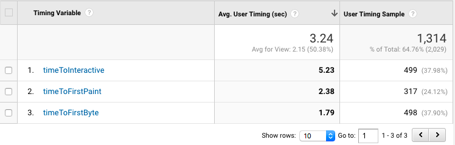
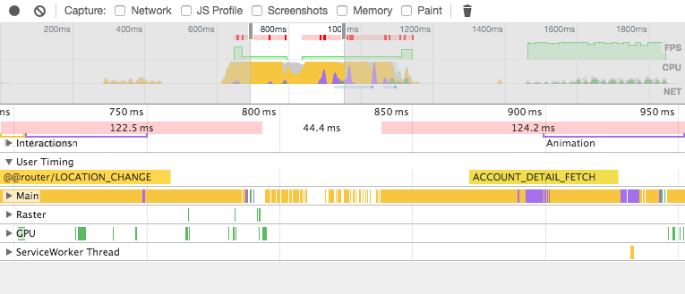
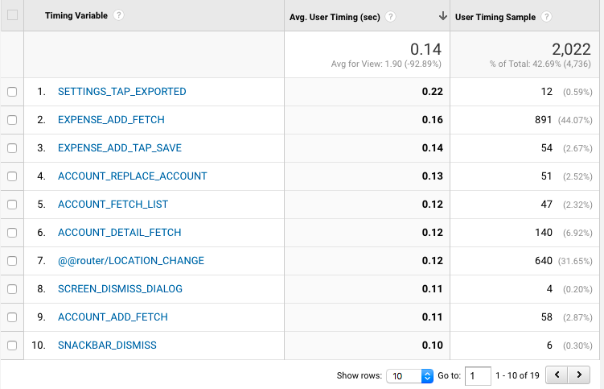
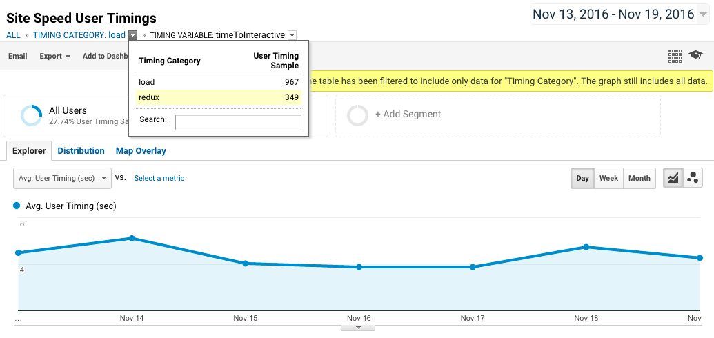

# browser-metrics

> A collection of metrics tools for measuring performance.

[](https://www.npmjs.com/package/browser-metrics)
[](https://www.npmjs.com/package/browser-metrics)
[](https://travis-ci.org/oliviertassinari/browser-metrics)

[](https://david-dm.org/oliviertassinari/browser-metrics)
[](https://david-dm.org/oliviertassinari/browser-metrics#info=devDependencies&view=list)

## Installation

```sh
npm install --save-dev browser-metrics
```

## The problem solved

This module helps getting insight about how your app performs in production.

## `browsingMetrics`

### What does it do?

This function is intended to measure the following metrics:
- Time to first byte (`timeToFirstByte`).
It represents how long users have waited to get the first byte from the server
- Time to first paint (`timeToFirstPaint`).
It represents how long users have waited to get the first paint on their screen.
- Time to interactive (`timeToInteractive`).
This is the time elapsed between the beginning of the navigation and the call to the tool. When used in the `componentDidMount` hook of React, it can be used to get the time needed to get an interactive interface.

*All the durations are in milliseconds and relative to the beginning of the navigation.*

It takes advantage of the `performance.timing` [model](https://www.w3.org/TR/navigation-timing/#processing-model).

### Example



Notices that research only show meaningful effect, at the product level, for the *time to interaction effect*.
Until research shows otherwise, you should probably consider the other metrics as simple technical indicators.
*[source](https://twitter.com/slightlylate/status/803187908110876672)*

### Usage

```js
import browsingMetrics from 'browser-metrics/lib/browsingMetrics';
import React from 'react';

class App extends React.Component {
  componentDidMount() {
    browsingMetrics({
      trackTiming: (category, name, duration) => {
        // Now, we can send the metrics to a third party to keep track of them.
      },
      sampleRate: 20,
      log: false,
    });
  }

  render() {
    return <div>{'This is the root node of my app.'}</div>
  }
}

export default App;
```

### API

#### `browsingMetrics(object)`

**Arguments**

1. `options` *(object)*
  - `trackTiming` *(Function)*: This callback property is called for each collected metrics with three arguments
    - `category` *(string)*: Is `load`.
    - `name` *(string)*: name of the metric being collected.
    - `duration` *(number)*: duration measured for this metric.
  - `[sampleRate=100]` *(number)*: It can be used to sample the data send to a third party. It's expressed in percentage. The data aren't sampled.
  E.g. when used with the timing API of Google Analytics, you might want to send a portion of the data.
  - `[log=false]` *(boolean)*: When turned to `true` the collected data are displayed in the console.

### Browser support

| Metric              | IE    | Edge | Firefox | Chrome | Safari |
|:--------------------|:------|:-----|:--------|:-------|:-------|
| `timeToFirstByte`   | >= 10 | ✓    | >= 38   | >= 25  | x      |
| `timeToFirstPaint`  | >= 10 | ✓    | x       | >= 12  | x      |
| `timeToInteractive` | >= 10 | ✓    | >= 38   | >= 25  | x      |

## `Metric`

### What does it do?

This class is intended to help to measure the time spent in transactions.
It's a simple helper around the [User Timing API](https://developer.mozilla.org/en-US/docs/Web/API/User_Timing_API) and the high resolution [Performance.now()](https://developer.mozilla.org/fr/docs/Web/API/Performance/now) method.

For browsers that support the *mark* API, the transaction also appears in the DevTools. E.g. with Chrome:



### Usage

```js
import Metric from 'browser-metrics/lib/Metric';

const metric = new Metric('ACCOUNT_DETAIL_FETCH');
metric.start();

// Do the CPU consuming work.

metric.end();
console.log(metric.duration); // 14.4 ms
```

### API

#### `Metric`*(Class)*

##### `duration`*(number)*

Returns the duration of the timing metric or -1 if there a measurement has not been made.

##### `start`*(Function)*

Call to begin a measurement.

##### `end`*(Function)*

Call to end a measurement.

### Browser support

| Feature             | IE    | Edge | Firefox | Chrome | Safari |
|:--------------------|:------|:-----|:--------|:-------|:-------|
| `performance.now`   | >= 10 | ✓    | >= 15   | >= 20  | >= 8   |
| `performance.mark`  | >= 10 | ✓    | >= 41   | >= 43  | x      |

## `reduxMetricsMiddelware`

### What does it do?

This is a [redux middleware](http://redux.js.org/docs/advanced/Middleware.html).
Redux has a nice design property, actions are performed synchronously in a transaction. That allow us to measure the time spent in each action.

When used with [react-redux](https://github.com/reactjs/react-redux) and the current *react-dom* reconciliation algorithm the time also take into account the `render` calls down the virtual DOM tree.

### Example



### Usage

```js
import metricsMiddleware from 'browser-metrics/lib/reduxMetricsMiddleware';
import { createStore, applyMiddleware } from 'redux';
const rootReducer = (store) => store;

const store = createStore(
  rootReducer,
  applyMiddleware(metricsMiddleware({
    trackTiming: (category, name, duration) => {
      // Now, we can send the metrics to a third party to keep track of them.
    },
    minDuration: 50,
  }))
);
```

### API

#### `metricsMiddleware(object)`

**Arguments**

1. `options` *(object)*
  - `trackTiming` *(Function)*: This callback property is called for each collected metrics with three arguments
    - `category` *(string)*: Is `redux`.
    - `name` *(string)*: name of the metric being collected.
    - `duration` *(number)*: duration measured for this metric.
  - `[minDuration=50]` *(number)*: It can be used to ignore non significant actions. An action must have a duration higher to `minDuration` to be reported.

## Google Analytics

Metrics can be reported to Google Analytics using the User Timing section.
E.g. with the [analytics.js](https://developers.google.com/analytics/devguides/collection/analyticsjs/) library.
```js
// https://developers.google.com/analytics/devguides/collection/analyticsjs/user-timings
window.ga('send', {
  hitType: 'timing',
  timingCategory: category,
  timingVar: name,
  timingValue: duration,
});
```

Then, you can see the values in the UI.



Notices the you shouldn't be using the mean as a performance indicator.
Using the mediam (50th percentile) would be a much better indicator.

## Ressources

- [Progressive Web Apps with React.js: Part 2 — Page Load Performance](https://medium.com/@addyosmani/progressive-web-apps-with-react-js-part-2-page-load-performance-33b932d97cf2)
- [The Difference Between Quantification, Measure, Metric, and KPI](http://www.bscdesigner.com/quantification-measure-metric-kpi.htm)

## Credit

- https://github.com/ebidel/appmetrics.js
- https://github.com/addyosmani/timing.js/blob/master/timing.js
- https://gist.github.com/acdha/a1fd7e91f8cd5c1f6916
- https://github.com/okor/justice/blob/master/src/js/justice.collectors.js

## License

MIT
